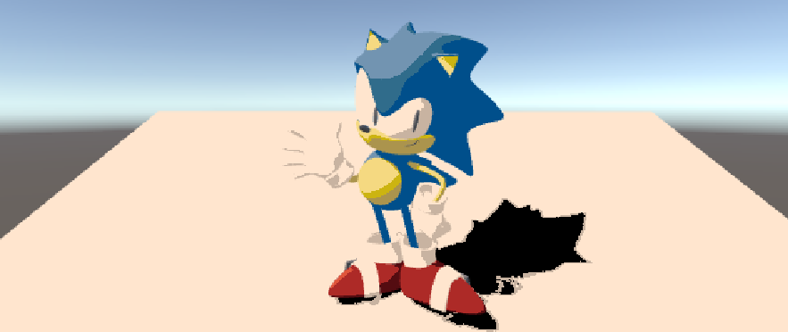

# Lab 05 - Stylization - Saksham Nagpal & Kyra Clark
Practicing stylization to a 3D scene using Unity's shader graph

### 1. Simple two-tone toon shading

### 2. Toon shading with 3 tones

### 3. Stylized Shadow

