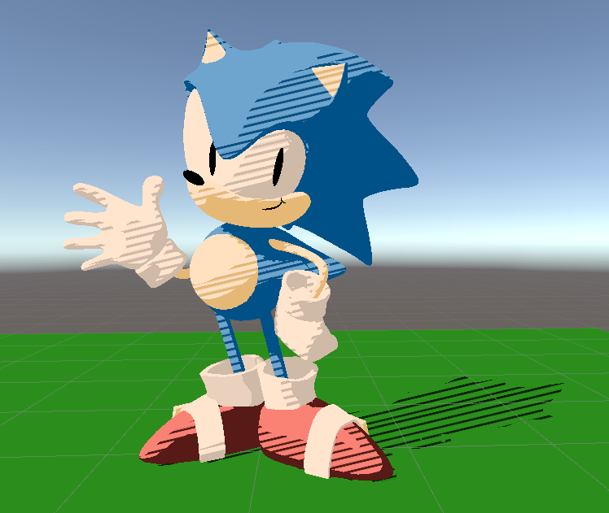

# Lab 05 - Stylization! (Yuhan + Diana Shadouyang)
         
### 1. Puzzle 1: Simple two-tone toon shading

 

### 2. Puzzle 2: Leveled-up toon shading

We created a Midtone color and a second threshold to allow for a third color in the toonshader. The HLSL file and parameters were adjusted accordingly. 

 

### 3. Puzzle 3: Stylized Shadow

We made the stripes into our midtone color from Puzzle 2 to stylize the blending between highlights and shadows. 

 
