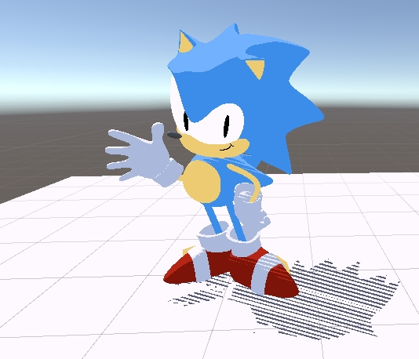

# Stylization!
Authors: Utkarsh Dwivedi & Linda Zhu

## Introduction
We practiced adding stylization to a 3D scene using Unity's shader graph. We want to create to a "toon" look that supports shadows and multiple lights in real-time. 

Our work is based on this tutorial video:
[Lab Overview and Puzzle 1 Tutorial Video](https://youtu.be/jc5MLgzJong)
         
## Implementation Details:
### Step 1: Simple two-tone toon shading
   

<!--  -->

   * To start off, we create a 2 band toon shader, and then create multiple materials based off of the shader graph.
   * We attach those materials to the objects (the sphere and plane) in the default scene "Lab Scene 1" to produce a look similar to the one above!

### Step 2: Leveled-up three-toon shading 

<!--  -->

   * We edit our materials to allow for a 3rd color in the scene, such that we have highlights, midtones, shadows on the objects. We also add additional thresholds to adjust the range of midtone and shadow nands.
   * Next, we shade the Sonic and shadow receiving plane in "Lab Scene 2" to get a look similar to the one above!

### Step 3: Shadow hatching

<!--  -->

   * We add two other outputs from the `ChooseColor3Tone` function such that we can multiply the patterned texture onto the midtons and shadows to apply the hatching effects.
   * We add some **extra swirl** by varying the hatching effects for midtones and shadows are achieved by sampling the texture using fragment's screen space position as UV, changing the tiling and offset and rotating the UV to get the final results.

### Extra swirl:
* We changed the floor to a [soccer field texture](https://stock.adobe.com/search?k=football+field+texture&asset_id=347841963). With the texture as the base color of the floor material, we need to multiply the highlight, midtone and shadow colors to the texture sample such that the shadows can preserve the texture details while overlaying the patterns.

